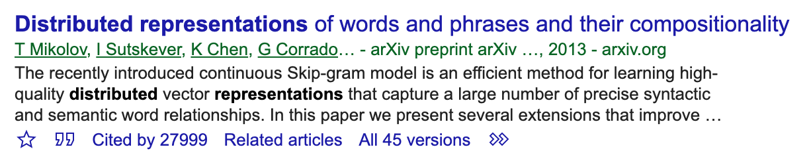

# exercise-13 word embeddings

What words can you insert into the blank space in the following sentences?

sentence 1 : ❝ I'm giving food to my pet ___ ❞

​                                                                      cat
​                                                                      dog

sentence 2 : ❝ ___ is the Queen of England ❞

​                         Elisabeth
​                         Victoria

​                         ~~Hildegart~~

The set words that you can insert into sentence 1 and 2 respectively share some characteristics, they have more in common with words from their group and with words from the other group. They have a *semantic proximity*.

## Why bother?

Remember exercise-11, where you performed a rudimentary grouping of tweets into topics by searching whether they contain a certain word. Obviously, that is not a very smart way. We could try to instead provide a list of terms related to the topic we're interested in, but we'd still have to rely on our understanding of language. Not very efficient.

## Basic idea

Word embeddings are based on a very simple idea:

❝ A word is determined by the company it keeps ❞

Let's take a small sample corpus, and for every word compute the probability that another word will be in the context (let's say 2 words before and after, without stop words):

* I am **play**ing with the **dog** in the **park**
* I am **play**ing **frisbee** in the **park**
* I am **eat**ing **pizza** in the **park**
* I don't like **eat**ing **broccoli**

|             | play | dog  | park | frisbee | eat  | pizza |  🥦   |
| ----------: | :--: | :--: | :--: | :-----: | :--: | :---: | :--: |
|    **play** |  0   |  1   |  ⅔   |    1    |  0   |   0   |  0   |
|     **dog** | 0.5  |  0   |  ⅓   |    0    |  0   |   0   |  0   |
|    **park** |  1   |  1   |  0   |    1    | 0.5  |   1   |  0   |
| **frisbee** | 0.5  |  0   |  ⅓   |    0    |  0   |   0   |  0   |
|     **eat** |  0   |  0   |  0   |    0    |  0   |   1   |  1   |
|   **pizza** |  0   |  0   |  ⅓   |    0    | 0.5  |   0   |  0   |
|           🥦 |  0   |  0   |  0   |    0    | 0.5  |   0   |  0   |

Now, we can represent each word using only numbers as vectors, where:
$$
dog = \begin{pmatrix}
1 \\
0 \\
1 \\
0 \\
\vdots \\
0
\end{pmatrix}, 
frisbee = \begin{pmatrix}
1 \\
0 \\
1 \\
0 \\
\vdots \\
0
\end{pmatrix},
pizza = \begin{pmatrix}
0 \\
0 \\
1 \\
0 \\
1 \\
0 \\
0
 \end{pmatrix},
broccoli = \begin{pmatrix}
0 \\
\vdots \\
0 \\
1 \\
0 \\
0
\end{pmatrix}
$$
🔔 Notice how the vectors for $dog$​ and $frisbee$ are seem similar to each other, as well as $broccoli$ and $pizza$. In fact, we can compute this similarity by using *cosine similarity*, which is just the dot product of the two vectors divided by the product of their magnitude, and returns 1 if the two vectors are identical, and 0 if they are orthogonal to each other. So:
$$
sim(dog, frisbee) = \frac{ ( 1 * 1)  + ( 1 * 1 ) } { \sqrt{1^2 + 1^2} * \sqrt{1^2 + 1^2}} = 1
$$

And likewise:
$$
sim(dog,pizza) = \frac{(1*1)} {\sqrt{2} * \sqrt{2})} = 0.5 \\
sim(dog, broccoli) = \frac{0} {...} = 0
$$
💡 This mathematically derived similarity measure works surprisingly well in capturing semantic similarity, provided the corpus the vectors are computed from is large enough. And even though there goes more into it especially when it comes to reducing the vector space, this is the basic idea of word embeddings. 

Though not an easy read, the following paper is where it all started:

## Word embeddings in `spaCy`

Please refer to the attached `exercise-13-demo.ipynb` to get some ideas how to use word embeddings with `spaCy`. Note that the `...sm` language model we used last exercise comes without word embeddings, so use `poetry run python -m spacy download en_core_web_lg` ( or `...md`) to download the larger one.

💫 When using `poetry`, you can install all dependencies listed in the `pyproject.toml` using `poetry install`. This is quite useful if you are working on someone else's project (or for getting all the libraries I'm using for today's notebook).

`spaCy` provided embedding vectors for `token`s, which are different from `strings`, so you first need to convert them using `token = nlp("string")`. Then you can check if `spaCy` has a vector entry for the `token` with `token.has_vector`. If so, then you can use `token.similarity(other_token)` to see the cosine similarity of `token` and `other_token`.

Unfortunately, `spaCy` doesn't currently offer an out of the box way to see the most similar words for a given one. The method in the notebook is written for clarity, but it is quite slow.

## Vector arithmetic

Vectors can be added and subtracted from each other, and will result in a new vector. That vector will be closer to some words' vectors than others. This has some fascinating implications: 

🤯 Imagine we take the vectors $queen$, subtract $woman$, and add $man$ - what ought the result be? Remember that there is no human involved in creating embeddings telling the model what word belongs to which category, which is absolutely fascinating.

## exercise-13

🎉 If you made it this far, congratulations! I hope you learned a lot from the exercises, and will find them useful for your future. Please don't hesitate to send me your feedback, and thank you for your participation!

