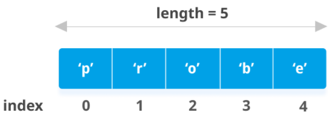

# exercise-3 Data types:`string` and `list`

* review exercise-2
* `git` in your IDE: Of course you can use whatever programming environment that you feel comfortable in! My recommendation is PyCharm, for which you can get a free license if you have a university e-mail address.

## Review exercise-2

👏 Good work on exerise-2! This exercise will be similarly easy, and in the next one you will tackle your first bigger project!

## What are datatypes? What is a `string`?

Originally, data types were used to indicate how much memory should be reserved for a variable. Now this is less important, but data types remain important because of the different operations that can be performed on them. For example, for an `int` (meaning *integer*, a number ∈ ℤ) the `+` operator is an addition, while for a `string` the `+` means a concatenation.

🧵 `string` could get its name from the fact that printers around 1900 would add text blocks for printing and tie them together with an actual string. 

➡️ This is a good way to think of a `string` in `python`: A `list` of `character`s, which can be as short as a single character or contain an entire book.

⚠️ Note that since `python3`, everything is in Unicode by default, so even `len("万")` is `1`.

Another important data type is the `boolean`, which can be either `True` or `False`. This is often used in conjunction with `if` statements:

```python
def is_true():
  return True

if is_true():
  print("It's not a lie!")
```


## `lists` and the `in` operator

* `list` is a data structure that can hold several items in an *ordered* way: So the items the `list` contains have an `index` by which they can be located. Note that in most programming languages, `python` included, indexing starts at 0.



* In `python`, a `list` is created using square brackets: `mylist = [1, 3, 7, 11]` or `mylist = ["Alle", "meine", "Entchen"]` or even `mylist = [1, "eins", ["一", "1️⃣"]]` (in `python`, a `list` can contain elements of varying data types, including other `list`s).
* We can access the item at the index `i` using the following syntax: `mylist[i]`, remembering that using `i = 0` will return the first item.
* To iterate, that is, to take each item in a `list` and perform some action with it, in `python` we use the `in` operator, giving each item in the list a *temporary* name by which we can adress it:

```python
mylist = ["Alle", "meine", "Entchen"]
for word in mylist:
  print(word)
```

* Note that if we use the `in` operator with a `string`, we're iterating through the `character`s in it.

## exercise-3

🕰 Submit your exercise at least 15' before the next session starts. 

1. Create a `pull request` to get the most recent version of the exercise, and sync your replit.com with it.
2. Open the `exercise-3-example.py` to learn about `string` manipulation.
3. Change the functions `tokenise(string)` and `is_palindrome(string)` in `palindrome.py`. Test them using `pytest` before submitting them using a `pull request`.