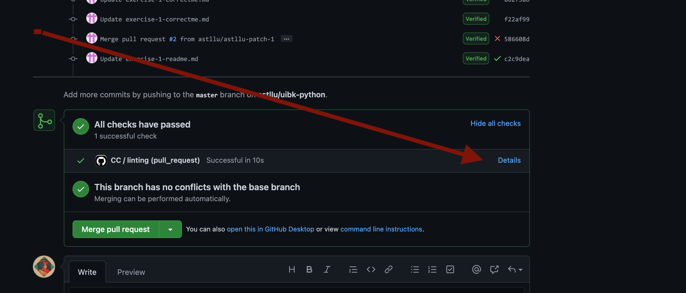
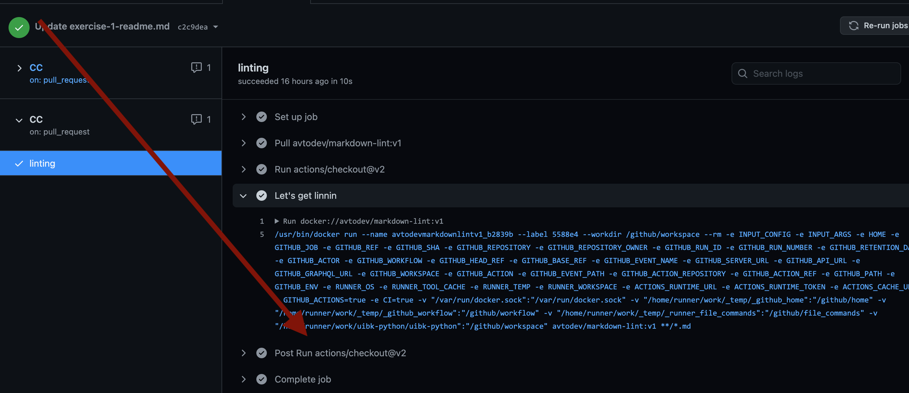

# Python for Linguists

Students are introduced to python, and the different techniques to process natural language texts automatically are explained. Experience in programming is desirable, but not necessary. Since the course is open to students without prior programming experience, sessions 2-4 are very general and not specific to natural language text processing.

There will be 13 exercises, which can be found on  [the course repository on github.com](https://github.com/Aequivinius/uibk-python). The first session is dedicated to the explanation of `git` in general and how we are using it in the course: All the exercises are handed in via `pull requests` and will be tested automatically. If a submission passes the tests, it is considered a success; and for the maximum grade students need to submit 10 successful exercises.

Since we are using `pytest` to automatically evaluate your submissions, avoid naming any of your files beginning with `test_` or ending with `_test`.

## Table of Contents

* exercise-1 Introduction to `git`
* exercise-2 Introduction and installation of `python`
* exercise-3 strings
  * Variables and types
  * Concatination, interpolation, search
  * regex
* exercise-4 lists, dictionaries, comprehensions
  * Loops
  * `in` operator etc.
* exercise-5 files
  * reading and writing files
  * `.csv`
* exercise-6 pep8, good documentation, good coding
  * Modularity, functions
  * Naming conventions
  * linting
* exercise-7 virtual environments
  * venv
  * pip
  * pipenv, poetry etc.
* exercise-8 jupyter
* exercise-9 pandas
* exercise-10 visualisation
* exercise-11 NLP project I
  * normalisation
  * spaCy
* exercise-12 NLP project II
  * word frequencies
* exercise-13 NLP project III
  * own miniature project

## Where can I get help?

🙋 Students ask questions in the form of *issues* in the main repository, so that everyone can benefit. Also, make sure you check the error logs of the automated tests as shown in the screenshots below.

