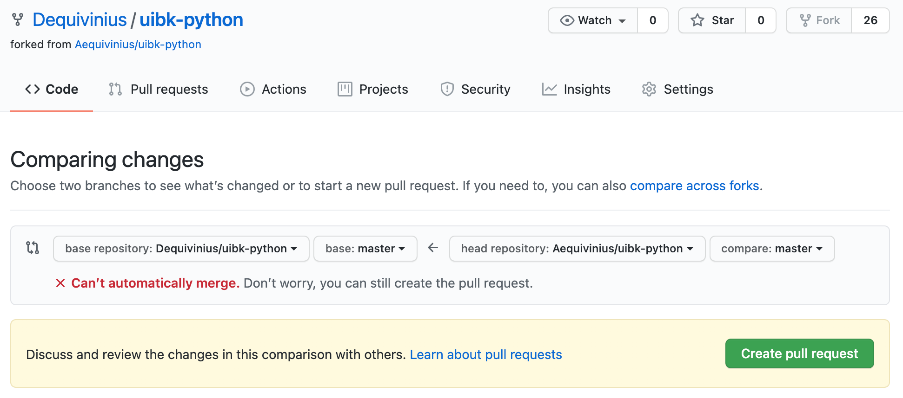
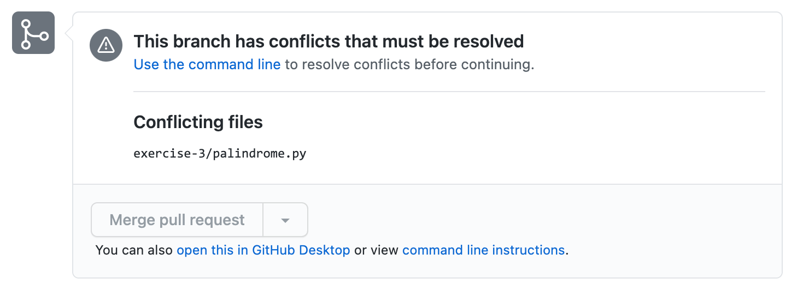
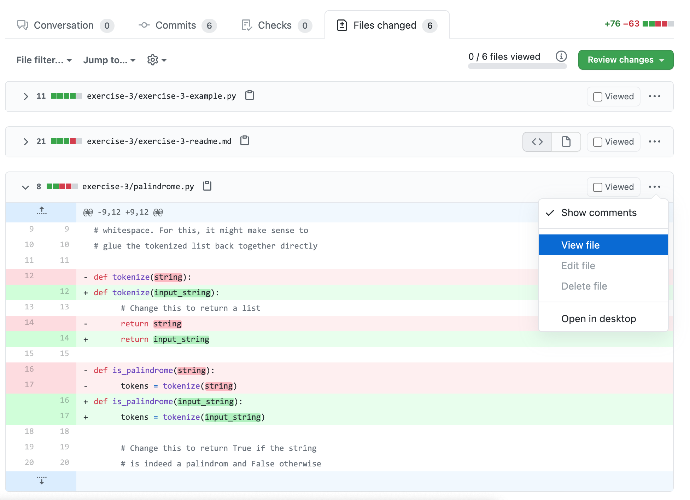

# Python for Linguists

Students are introduced to python, and the different techniques to process natural language texts automatically are explained. Experience in programming is desirable, but not necessary. Since the course is open to students without prior programming experience, sessions 2-4 are very general and not specific to natural language text processing.

There will be 13 exercises, which can be found on  [the course repository on github.com](https://github.com/Aequivinius/uibk-python). The first session is dedicated to the explanation of `git` in general and how we are using it in the course: All the exercises are handed in via `pull requests` and will be tested automatically. If a submission passes the tests, it is considered a success; and for the maximum grade students need to submit 10 successful exercises. Since we are using `pytest` to automatically evaluate your submissions, avoid naming any of your files beginning with `test_` or ending with `_test`.

## Table of Contents

* exercise-1 Introduction to `git`
* exercise-2 Introduction and installation of `python`
* exercise-3 Data types: `string` and `list`
* exercise-4 `dict`
* exercise-5 `comprehension`s, reading and writing files, `.csv`
* exercise-6 pep8, good documentation, good coding, linting, `regex`, user arguments, `import csv`
* exercise-7 virtual environments: `venv`, `pip` and `poetry`
* exercise-8 jupyter
* exercise-9 pandas
* exercise-10 visualisation
* exercise-11 NLP project I: normalisation, `nltk`
* exercise-12 NLP project II: word frequencies, palindromes 2?, `spaCy`
* exercise-13 NLP project III: miniature project

## How to use `git` for this course

To get the new exercise, you have to create a `pull request` from the course repository into you own repository. Then, `pull` the new files into your repl.

// TODO make screenshots of this

I recommend that the students use the web interface of github.com and replit.com to manage their `commit`s, so that they don't have to deal too much with the intricacies of `git` and can focus on the programming. 

Should there be problems with the `commit` history and with `pull request`s, check the following points:

* Make sure you're on *your* `fork` of the project and that the `pull request` runs in the right direction (`YourName / uibk-python` ⬅️ `Aequivinius / uibk-python` for getting the new exercise, and the other way for submitting your solution).
* If you receive a message `❌ Can't automatically merge`, issue the `pull request` anyway. 

* You'll receive a list of *conflicting files*, which you delete. 

* Then you should be able to then proceed with your `pull request`. Should the problem persist, check the *Files changed* tab, ⠐⠐⠐ and *View file* for the file that is causing the conflict. Copy its contents and paste them in your repository at the correct location.

* As a method of last resort you can always delete your repository (⚙️ Settings, then Danger Zone at the bottom of the screen) and create a fresh `fork`.

## Where can I get help?

🙋 Students ask questions in the form of *issues* in the main repository, so that everyone can benefit. Make sure to include enough information such as screenshots and so on. Also, make sure you check the error logs of the automated tests as shown in the screenshots below.

## Further Reading

* [The Hitchhiker's Guide to Python](https://docs.python-guide.org/)
* One of your fellow students suggested [this website](https://www.py4e.com/lessons)